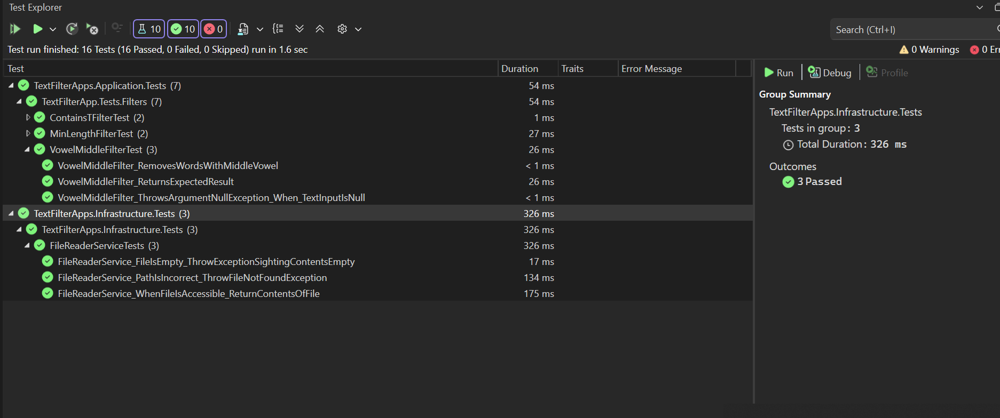

# CANDIDATE CODING ASSIGNMENT

## ASSIGNMENT
Create three text filters that can be applied to the given text and write both the the source and transformed text to the console.
The requested three filters are as follows:
1. Filter1 – filter out all the words that contains a vowel in the middle of the word – the centre 1 or 2 letters ("clean" middle is ‘e’, "what" middle is ‘ha’, "currently" middle is ‘e’ and should be filtered, "the", "rather" should not be) 
2. Filter2 – filter out words that have length less than 3 
3. Filter3 – filter out words that contains the letter ‘t’

## ASSUMPTIONS
1. The filters should be applied in the order listed in the assignment.
2. Punctuations are considered part of the word but removed before the vowel and length rules are applied.

## Application

Dear Calastone,

This is my application which i believe solves the issue described. Within the src folder you will find my application seperated into 3 layers
- TextFilterApps.Presentation (UI)

- TextFilterApps.Application

- TextFilterApps.Infrastructure

  

To run please run from TextFilterApps.Presentation.

## Unit Tests

Next to the src folder will be a tests folder. This will hold Unit tests for the application.
They all should pass as shown below.

Kind regards

Caleb
